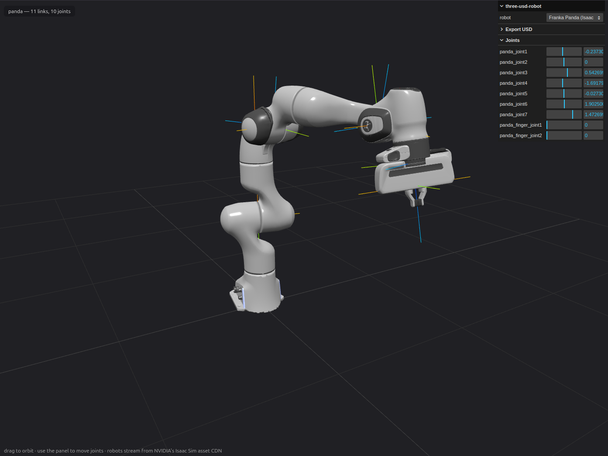

# three-usd-robot

> **Kinematic OpenUSD robot loader — and exporter — for Three.js.**
> Load Isaac Sim / OpenUSD robot assets, control their joints in the browser,
> and write scenes back out as USD. No physics engine, no OpenUSD/WASM
> dependency.

Think of it as a **USD version of [`urdf-loader`](https://www.npmjs.com/package/urdf-loader)**:
it reads the link / joint / xform / mesh structure out of `UsdPhysics` assets
and drives forward kinematics on a Three.js `Object3D` hierarchy.

**[▶ Live demo](https://three-usd-robot.vercel.app)** — stock Isaac Sim robots
streamed from NVIDIA's asset CDN, joints driven from a slider panel, and
exported back to `.usda` / `.usdz` in the browser.




## Features

- **Formats** — ASCII `.usda`, binary `.usdc` / `.usd`, and `.usdz`, auto-detected.
  Multi-file assets (references / payloads / sublayers), variant selections and
  instanceable prims are composed for you.
- **Robots** — links, joints (fixed / revolute / continuous / prismatic), limits,
  drives, mimic couplings (gripper finger linkages) and the initial pose become
  a `setJointValue`-able hierarchy.
- **Rendering** — meshes, solid gprims, point clouds and curves with `UsdShade`
  materials (UsdPreviewSurface / Omniverse MDL / MaterialX, plus optional TSL
  graph execution on WebGPU) and textures; up-axis and units normalized
  automatically. Articulation-free stages load as static scenes.
- **Lighting** — `UsdLux` lights (distant / sphere / rect / disk, ShapingAPI
  cones, ShadowAPI) become Three.js lights with shadows preconfigured, and
  DomeLights become HDRI environment lighting via
  `three-usd-robot/rendering`.
- **Animation** — plays back time-sampled joint trajectories, and replays
  baked body-transform recordings through `setLinkTransforms` with
  constraint diagnostics.
- **Export** — write robots and whole cells back to `.usda` / `.usdz`,
  simulation-ready for Isaac Sim.
- **React** — declarative `<UsdRobot>` for React Three Fiber.

Stock Isaac Sim robot assets load straight from their public CDN — Franka
Panda, UR10e, Fanuc CRX-10iA/L, Kuka KR210, Shadow Hand, Unitree H1/Go2 and
friends all compose from their variant-driven, multi-layer form:

```ts
const ROOT = "https://omniverse-content-production.s3-us-west-2.amazonaws.com/Assets/Isaac/5.1";
const franka = await new ThreeUsdRobotLoader()
  .loadAsync(`${ROOT}/Isaac/Robots/FrankaRobotics/FrankaPanda/franka.usd`);

franka.setJointValues({ panda_joint2: -0.785, panda_joint4: -2.356, panda_joint6: 1.571 });
franka.getLinkWorldPosition("panda_hand"); // (0.307, 0, 0.590) — the documented ready pose
```

The CDN is public and CORS-enabled, so this works in the browser too. Try
`npx tsx scripts/demo-franka.ts` for a console walkthrough (articulation table,
FK check, and a re-export to one self-contained file), or open the Vite example
and pick a robot from the preset list.

## Install

```sh
npm install three-usd-robot three
```

`three` is a **peer dependency** (`>=0.160.0`).

## Quick start

```ts
import { ThreeUsdRobotLoader } from "three-usd-robot";

// .usda / .usdc / binary .usd / .usdz are all auto-detected.
const robot = await new ThreeUsdRobotLoader().loadAsync("/assets/arm.usda");
scene.add(robot);

// Drive joints (revolute/continuous in radians, prismatic in stage units).
robot.setJointValues({ joint1: 0.4, joint2: -0.2 });

// Forward kinematics falls out of the Three.js scene graph.
const handMatrix = robot.getLinkWorldMatrix("tool0"); // THREE.Matrix4
const handPos = robot.getLinkWorldPosition("tool0"); // THREE.Vector3

robot.getJointNames(); // commandable joints
robot.getKinematicTree(); // root, ordering, loop joints, ...
```

`parse` also takes in-memory content (USDA text, an `ArrayBuffer` / typed
array / `Blob` — the format is sniffed, so a dropped `File` works as-is), and
the loader normalizes units and up-axis for you: Isaac's Z-up assets stand
upright in a Y-up three.js scene by default, or pass `worldUp: "Z"` for a
robotics-style Z-up world. Details in the [runtime guide](./docs/runtime.md).

## Documentation

| Doc | Contents |
| --- | --- |
| [Runtime guide](./docs/runtime.md) | Input sources, up-axis & units, naming contract, mimic joints, viewer helpers & ghosts, static scenes, joint sliders, React Three Fiber, using the core without Three.js |
| [Materials](./docs/materials.md) | UsdPreviewSurface fidelity, Omniverse MDL family mappings, MaterialX, optional TSL graph execution (WebGPU) |
| [Lighting](./docs/lighting.md) | UsdLux → Three.js lights, DomeLight → IBL environment, shadow defaults, intensity calibration for Omniverse assets |
| [Animation & recorded playback](./docs/recorded-playback.md) | Time-sampled trajectories, baked body-transform recordings, constraint diagnostics & joint projection |
| [Exporting USD](./docs/export.md) | Re-export, `RobotBuilder` authoring, simulation-ready assets (mass / collision / Isaac Robot Schema), USDZ packaging |

## Export USD

The loader's inverse — author a robot from Three.js meshes and open it in
Isaac Sim:

```ts
import { RobotBuilder, serializeUsda } from "three-usd-robot";

const builder = new RobotBuilder({ name: "my_robot" });
builder.addLink({ name: "base", visuals: [baseMesh] });
builder.addLink({ name: "arm", frame: armFrame, visuals: [armMesh] });
builder.addFixedJoint({ name: "root_joint", child: "base" });
builder.addRevoluteJoint({
  name: "j1", parent: "base", child: "arm",
  frame: jointFrame, axis: "Z", lower: -Math.PI, upper: Math.PI,
});
writeFileSync("robot.usda", serializeUsda(builder.toUsda()));
```

Limits, drives, mimic couplings, the initial pose, mass properties and
collision setup all serialize — see [Exporting USD](./docs/export.md).

## Examples

[`examples/`](./examples) holds runnable Vite demos:

- **`vite-usd-inspector`** — the [live demo](https://three-usd-robot.vercel.app):
  vanilla Three.js + `lil-gui`, with a robot picker, a USD structure panel
  (prim tree + attribute inspector), a transform gizmo, joint sliders,
  animation playback and USD export.
- **`vite-basic-viewer`** — the same thing through React Three Fiber.
- **`vite-webgpu-nodes`** — MaterialX graph execution (TSL) on `WebGPURenderer`.

The viewers take `?asset=<url>` for any asset, or `?isaac=<path under Isaac/>`
to pull one straight from NVIDIA's CDN. `npm run demo:build` generates the
factory cell and builds the deployable site.

## Package entry points

| Import | Contents |
| --- | --- |
| `three-usd-robot` | Three.js runtime — `ThreeUsdRobotLoader`, `ThreeUsdRobot`, `RobotBuilder`, export helpers |
| `three-usd-robot/core` | Three.js-independent USD parser & writer, robot IR, forward-kinematics math |
| `three-usd-robot/helpers` | Viewer helpers (joint axes, link frames, joint limits, highlights, ghosts) |
| `three-usd-robot/extras` | Joint slider panel (bring your own `lil-gui`) |
| `three-usd-robot/nodes` | Optional MaterialX → TSL execution (`three/webgpu`) — `createMaterialXNodeFactory`, `loadMaterialXDocument` |
| `three-usd-robot/react` | React Three Fiber `<UsdRobot>` component + hooks |

## Development

```sh
npm install
npm run typecheck   # tsc --noEmit
npm test            # vitest
npm run build       # tsup -> dist/
npm run check       # biome lint + format (autofix)
```

## License

MIT
