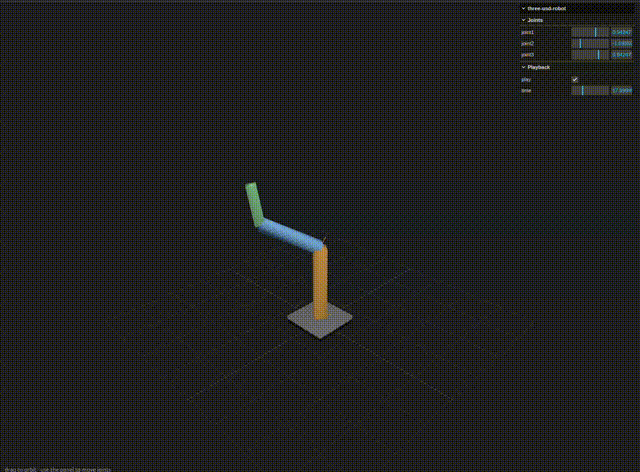

# three-usd-robot

> **Kinematic OpenUSD robot loader for Three.js.**
> Load Isaac Sim / OpenUSD robot assets, extract joints and links, and control
> articulations directly in the browser — no physics engine required.

Think of it as a **USD version of [`urdf-loader`](https://www.npmjs.com/package/urdf-loader)**:
it reads the link / joint / xform / mesh structure out of `UsdPhysics` robot assets
and drives forward kinematics on a Three.js `Object3D` hierarchy.

> 🚧 **Status: v0.3.** Loads **ASCII `.usda`**, **binary `.usdc` / `.usd`
> (crate)**, and **`.usdz`** robots — including **multi-file assets** via
> references / payloads / sublayers (resolved across `.usda` *and* binary layers,
> with relationship-path remapping), **variant selections**, and **instanceable**
> prims — drives forward kinematics with meshes, applies flat **`UsdShade`
> material colors** (UsdPreviewSurface / OmniPBR constants) and **diffuse
> textures** (`UsdUVTexture`), normalizes up-axis & units, seeds the initial
> pose, and **plays back time-sampled joint trajectories**. The crate reader is a
> from-scratch TypeScript implementation (no OpenUSD/WASM dependency). Not yet:
> time samples and variant *selection* stored inside binary crate.

```ts
// .usda / .usdc / binary .usd / .usdz are all auto-detected:
const robot = await new ThreeUsdRobotLoader().loadAsync("/assets/robot.usd");
// or from bytes you already have:
const robot = await new ThreeUsdRobotLoader().parseCrate(usdcBytes);
```



## Install

```sh
npm install three-usd-robot three
```

`three` is a **peer dependency** (`>=0.160.0`).

## Usage

```ts
import { ThreeUsdRobotLoader } from "three-usd-robot";

const robot = await new ThreeUsdRobotLoader().loadAsync("/assets/arm.usda");
scene.add(robot);

// Drive joints (revolute/continuous in radians, prismatic in stage units).
robot.setJointValues({ joint1: 0.4, joint2: -0.2 });

// Forward kinematics falls out of the Three.js scene graph.
const handMatrix = robot.getLinkWorldMatrix("tool0"); // THREE.Matrix4
const handPos = robot.getLinkWorldPosition("tool0"); // THREE.Vector3

robot.getJointNames(); // controllable joints
robot.getKinematicTree(); // root, ordering, loopJoints, ...
```

### Viewer toggles & helpers

```ts
robot.showVisual = true;
robot.showCollision = false;
robot.showJointAxes = true; // built-in axes gizmos on each joint
robot.showLinkFrames = false;

import { addJointLimitHelpers } from "three-usd-robot/helpers";
addJointLimitHelpers(robot); // arc (revolute) / segment (prismatic) per joint
```

### Joint slider panel (lil-gui)

```ts
import GUI from "lil-gui";
import { createJointSliderPanel } from "three-usd-robot/extras";

createJointSliderPanel(robot, new GUI()); // one slider per articulated joint
```

The `extras` panel takes the GUI instance from you, so the library never bundles
`lil-gui`. See [`examples/`](./examples) for runnable Vite demos.

### Animation playback

If the asset has time-sampled joint trajectories (joint-state or drive-target
time samples), the robot plays them back:

```ts
if (robot.hasAnimation()) {
  const { start, end } = robot.getTimeRange()!;
  const fps = robot.getTimeCodesPerSecond();
  // in your render loop, advance a time code and sample:
  robot.setTime(t); // interpolates every animated joint and updates FK
}
```

### Inspect without Three.js

```ts
import { parseUsda, Stage, extractRobotDescription } from "three-usd-robot/core";

const desc = extractRobotDescription(Stage.OpenFromString(usdaText));
console.log(desc.rootLink, Object.keys(desc.joints));
```

## Package entry points

| Import | Contents |
| --- | --- |
| `three-usd-robot` | Three.js runtime — `ThreeUsdRobotLoader`, `ThreeUsdRobot` |
| `three-usd-robot/core` | Three.js-independent USDA parser, robot IR, forward-kinematics math |
| `three-usd-robot/helpers` | Viewer helpers (joint axes, link frames, joint limits) |
| `three-usd-robot/extras` | Heavier convenience utilities (e.g. joint slider panel) |

## Development

```sh
npm install
npm run typecheck   # tsc --noEmit
npm test            # vitest
npm run build       # tsup -> dist/
npm run check       # biome lint + format (autofix)
```

## License

MIT
