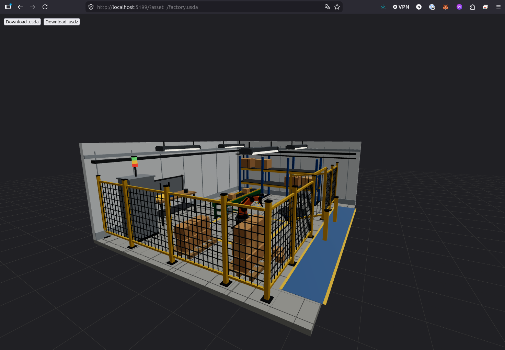
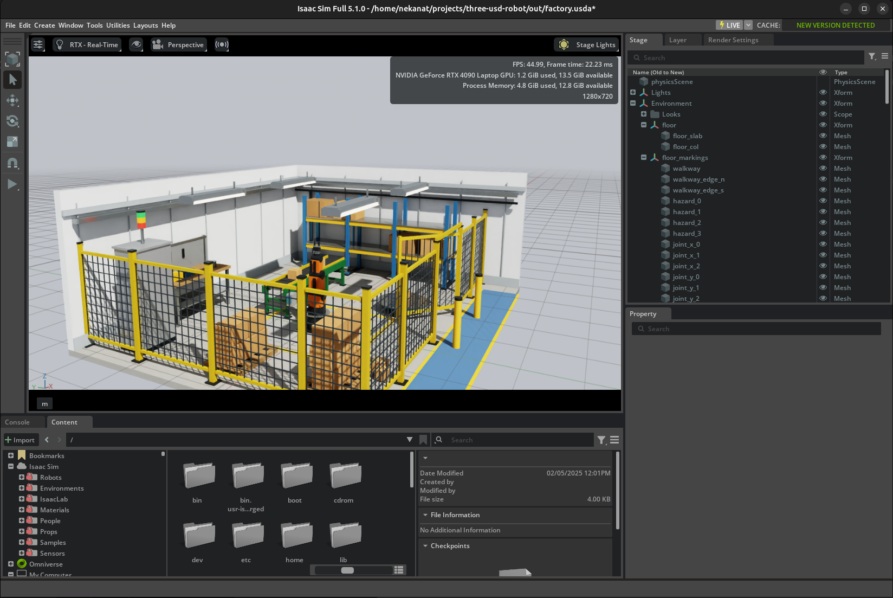

# three-usd-robot

> **Kinematic OpenUSD robot loader — and exporter — for Three.js.**
> Load Isaac Sim / OpenUSD robot assets, control their joints in the browser,
> and write scenes back out as USD. No physics engine, no OpenUSD/WASM
> dependency.

Think of it as a **USD version of [`urdf-loader`](https://www.npmjs.com/package/urdf-loader)**:
it reads the link / joint / xform / mesh structure out of `UsdPhysics` assets
and drives forward kinematics on a Three.js `Object3D` hierarchy.



## Features

- **Formats** — ASCII `.usda`, binary `.usdc` / `.usd`, and `.usdz`, auto-detected.
  Multi-file assets (references / payloads / sublayers), variant selections and
  instanceable prims are composed for you.
- **Robots** — links, joints (fixed / revolute / continuous / prismatic), limits,
  drives and the initial pose become a `setJointValue`-able hierarchy.
- **Rendering** — meshes with `UsdShade` materials (UsdPreviewSurface / OmniPBR)
  and textures; up-axis and units normalized automatically.
- **Animation** — plays back time-sampled joint trajectories.
- **Export** — write robots and whole cells back to `.usda` / `.usdz`,
  simulation-ready for Isaac Sim.
- **React** — declarative `<UsdRobot>` for React Three Fiber.

Not yet supported: time samples and variant *selections* stored inside binary
crate files, and full material/shader fidelity.

## Install

```sh
npm install three-usd-robot three
```

`three` is a **peer dependency** (`>=0.160.0`).

## Quick start

```ts
import { ThreeUsdRobotLoader } from "three-usd-robot";

// .usda / .usdc / binary .usd / .usdz are all auto-detected.
const robot = await new ThreeUsdRobotLoader().loadAsync("/assets/arm.usda");
scene.add(robot);

// Drive joints (revolute/continuous in radians, prismatic in stage units).
robot.setJointValues({ joint1: 0.4, joint2: -0.2 });

// Forward kinematics falls out of the Three.js scene graph.
const handMatrix = robot.getLinkWorldMatrix("tool0"); // THREE.Matrix4
const handPos = robot.getLinkWorldPosition("tool0"); // THREE.Vector3

robot.getJointNames(); // controllable joints
robot.getKinematicTree(); // root, ordering, loop joints, ...
```

Already have the bytes? Use `parse(usdaText)`, `parseCrate(usdcBytes)` or
`parseUsdz(bytes)` instead of `loadAsync`.

### Viewer toggles & helpers

```ts
robot.showVisual = true;
robot.showCollision = false;
robot.showJointAxes = true; // built-in axes gizmos on each joint
robot.showLinkFrames = false;

import { addJointLimitHelpers } from "three-usd-robot/helpers";
addJointLimitHelpers(robot); // arc (revolute) / segment (prismatic) per joint
```

Loading a whole cell rather than a bare robot? Pass
`{ loadSceneGeometry: true }` to the loader to draw the static environment
(floor, guarding, racking, …) around the machines.

### Joint slider panel (lil-gui)

```ts
import GUI from "lil-gui";
import { createJointSliderPanel } from "three-usd-robot/extras";

createJointSliderPanel(robot, new GUI()); // one slider per articulated joint
```

The panel takes the GUI instance from you, so the library never bundles
`lil-gui`.

### Animation playback

If the asset has time-sampled joint trajectories, the robot plays them back:

```ts
const range = robot.getTimeRange();
if (range) {
  // in your render loop, advance a time code between range.start and range.end:
  robot.setTime(t); // interpolates every animated joint and updates FK
}
```

### React Three Fiber

`three-usd-robot/react` provides a declarative `<UsdRobot>` (`react` and
`@react-three/fiber` are **optional** peer deps):

```tsx
import { Canvas } from "@react-three/fiber";
import { Suspense } from "react";
import { UsdRobot } from "three-usd-robot/react";

<Canvas camera={{ position: [2, 2, 2] }}>
  <Suspense fallback={null}>
    <UsdRobot
      url="/robot.usda"
      jointValues={{ joint1: 0.4 }} // controlled
      showJointAxes
      animate // play time-sampled trajectories
      onLoad={(robot) => console.log(robot.getJointNames())}
    />
  </Suspense>
  <ambientLight />
</Canvas>;
```

Also exported: `useUsdRobot(url)` (Suspense loader), `useRobotAnimation(robot)`,
`preloadUsdRobot`, `clearUsdRobotCache`. Pass a `ref` to `<UsdRobot>` for the
imperative API.

## Export USD

The loader's inverse: re-export something you loaded, or author a robot from
Three.js objects and open the result in Isaac Sim.



```ts
import {
  exportThreeUsdRobot,
  RobotBuilder,
  serializeUsda,
  writeUsdz,
} from "three-usd-robot";

// Re-export a loaded robot (meshes harvested from the Three.js scene):
const usda = serializeUsda(exportThreeUsdRobot(robot));

// …or build one from Three.js meshes. Z-up and metres by default; each joint
// takes ONE world-space frame, and the build-time arrangement is the zero pose.
const builder = new RobotBuilder({ name: "my_robot" });
builder.addLink({ name: "base", visuals: [baseMesh] });
builder.addLink({ name: "arm", frame: armFrame, visuals: [armMesh] });
builder.addFixedJoint({ name: "root_joint", child: "base" });
builder.addRevoluteJoint({
  name: "j1", parent: "base", child: "arm",
  frame: jointFrame, axis: "Z", lower: -Math.PI, upper: Math.PI,
});

const file = builder.toUsda();
writeFileSync("robot.usda", serializeUsda(file));
writeFileSync("robot.usdz", writeUsdz({ "robot.usda": serializeUsda(file) }));
```

Joints export as `UsdPhysics` prims with their limits, drives and initial pose.
For a simulation-ready asset, links also take mass properties, and collision
meshes take physics materials and a collision approximation:

```ts
builder.addLink({
  name: "arm",
  visuals: [armMesh],
  collisions: [armCollisionMesh],
  inertial: { mass: 2.5, centerOfMass: [0, 0, 0.2], diagonalInertia: [0.02, 0.02, 0.004] },
  collisionApproximation: "convexHull",
  physicsMaterial: { name: "steel", staticFriction: 0.6, dynamicFriction: 0.5 },
});
```

Both screenshots above come from `npx tsx scripts/demo-factory.ts`, which
authors a complete robot cell — a 7-DOF arm with a gripper, a conveyor, a
turntable and the surrounding scenery — and exports it to
`out/factory.usda` / `.usdz`.

## Use it without Three.js

`three-usd-robot/core` is a standalone USD parser, writer and robot IR — handy
for server-side validation or asset tooling:

```ts
import { parseUsda, Stage, extractRobotDescription } from "three-usd-robot/core";

const desc = extractRobotDescription(Stage.OpenFromString(usdaText));
console.log(desc.rootLink, Object.keys(desc.joints));
```

Command line: `npx tsx scripts/usdc-to-usda.ts robot.usd` converts binary crate
and `.usdz` packages to ASCII USDA.

## Examples

[`examples/`](./examples) holds runnable Vite demos, including a React Three
Fiber viewer that loads any asset via `?asset=<url>` and exports it back to
`.usda` / `.usdz`.

## Package entry points

| Import | Contents |
| --- | --- |
| `three-usd-robot` | Three.js runtime — `ThreeUsdRobotLoader`, `ThreeUsdRobot`, `RobotBuilder`, export helpers |
| `three-usd-robot/core` | Three.js-independent USD parser & writer, robot IR, forward-kinematics math |
| `three-usd-robot/helpers` | Viewer helpers (joint axes, link frames, joint limits) |
| `three-usd-robot/extras` | Joint slider panel (bring your own `lil-gui`) |
| `three-usd-robot/react` | React Three Fiber `<UsdRobot>` component + hooks |

## Development

```sh
npm install
npm run typecheck   # tsc --noEmit
npm test            # vitest
npm run build       # tsup -> dist/
npm run check       # biome lint + format (autofix)
```

## License

MIT
